# Engineer

## 1 CAN 

### 1.1 CAN硬件组成

### 1.2 CAN通讯数据格式

### CAN FD

CAN FD 是CAN with Flexible Data rate的缩写。也可以简单的认为是传统CAN的升级版。

对比传统CAN[总线技术](https://www.zhihu.com/search?q=总线技术&search_source=Entity&hybrid_search_source=Entity&hybrid_search_extra={"sourceType"%3A"article"%2C"sourceId"%3A79389547})，CAN FD有两方面的升级：

1. 支持可变速率—> 最大5Mbit/s；
2. 支持更长数据长度--> 最长64 bytes数据。

CAN-FD：可以理解成CAN协议的升级版，只升级了协议，物理层未改变。

**为什么需要CAN FD？**

在汽车行业，为什么需要CAN FD？

1. 原因主要是因为汽车功能越来越多，越来越复杂，传统的CAN总线（CAN2.0）的负载率越来越高，甚至负载率高达95%。

2. 因为传统CAN总线的局限性：

​	· 传输率最大为1Mbiy/s（典型的<= 500kbit/s）；

​	· 传统CAN数据帧超过50%的额外开销（overhead > 50%）。

3. 对比其他协议，额外开销比例要小得多，如UDP （1500 bytes/datagram, 64 bytes overhead），FlexRay（254 bytes/frame, 8 bytes overhead）。
4. 因为历史原因，汽车不可能直接放弃目前的传统CAN总线技术，一切推到重来。那么为了解决CAN总线负载率问题，而又能兼容CAN总线，并且研发成本不能太高的问题，2015年最新的修订版ISO 11898-1（classic CAN和CAN FD）发布。

### CAN 通讯速率

#### bit Rate位速率

CAN里面的位速率表述，每秒传输的二进制位的数量。单位是bps（bit per second）(Byte/s = 8 * bit/s)

#### bit time位时间

位速率的倒数，表示一个二进制数在总线上传输所需要的时间。

#### Time Quanta (TQ)时间量

一个位分为4段，这些段又由称为Tq的最小时间单位构成。

1位分为4个段，每个段又由若干个Tq构成，这称为**位时序**。

 位时序可以任意设定，也就是说可以任意设定一个位中的任意一个段由多少个Tq组成。

通过设定位时序，多个节点可同时采样，也可任意设定采样点。也就是说图2中各个节点都可以通过不同的配置可能获得不同的位速率和采样精度，后面通过实例来讲解。


关于各段的作用和可配置Tq范围如下图：

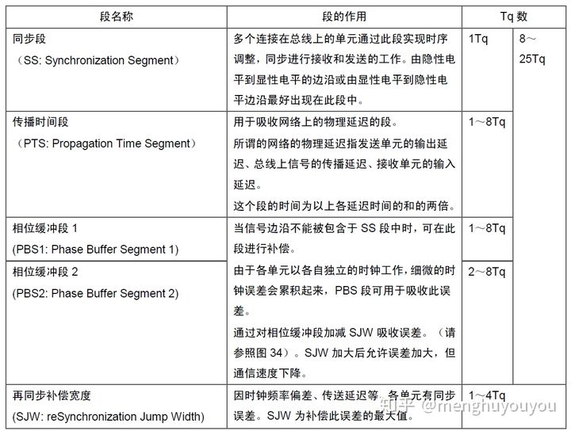

#### 计算方法

Infineon芯片手册提供的CAN总线位时间标准格式定义如下图9，后面根据该定义进行求解。

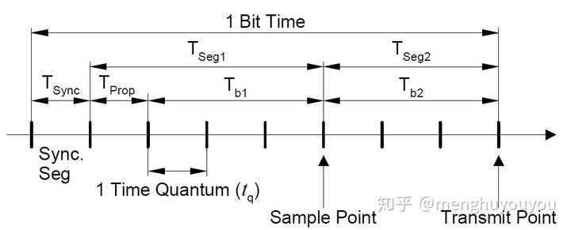

**假设：**

晶振时钟周期频率为40MHz，转换为时间表示则为T=1/40MHz=25ns （即芯片运行的最小时间单位为25ns），

**名义位时间**（Nominal Bit Time, NBT）为16 (即一个位有16个tq，time quantum)。

因为要设置的位速率为500KBaud，换算时间表示则为1/500KBaud =2000ns，即传输一个位的时间要2000ns。

那意味着16个tq就等于2000ns，即tq=125ns。

根据芯片手册，有定义：

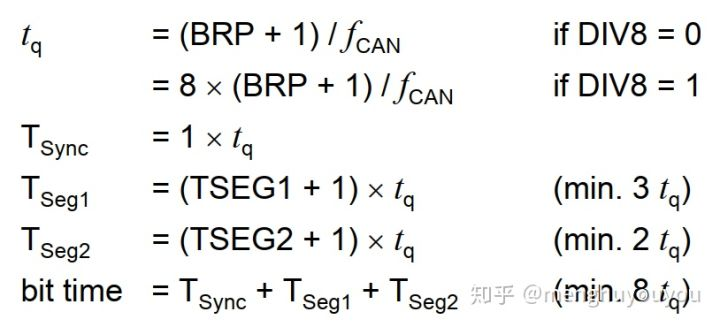

The CAN Tq clock  is calculated by dividing the CAN clock (fCAN) by the baud rateprescaler. 

One clock cycle of the CAN Tq clock is 1 Time Quantum (Tq).

晶振时钟周期时间，从上面可知为25ns。

BRP为位速率分频值（Baud Rate Prescaler)，该值可配置。

由上述定义可得：tq/T=125ns/25ns=5，因为BRP只能为整数，这时只能取DIV8=0，BRP=4。

又有NBT=16，采样点取在50%处，结合图9和上面的公式计算：

50% = Tseg2 / NBT= [(TSEG2+1)tq]/16*tq = (TSEG2+1)/16

Tseg1= NBT-Tseg2-Tsync = 7tq

即可得：**TSEG2 = 7， TSEG1=6**。

再根据下式计算SJW, 这里直接假设TSJW=3*tq能保证下式两个不等式成立（不在此处展开Tprope的讨论），那么**SJW=2**。

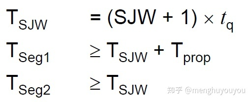

**综上有：DIV8=0, BRP=4，TSEG1=6，TSEG2=7，SJW=2。**

如有必要，最后利用下式验算最大相对误差：

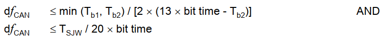

### 参考链接

https://zhuanlan.zhihu.com/p/278394305

## 2 DV（设计验证）

### 0 外设

1.CAN

1.1 功能

1.1.1 可以正常通信。

1.2 指标

1.2.1 速率符合要求

1.2.2 通信质量符合要求

2.LED

能正常亮灭

电流电压正常

3.BUTTON

能正常触发

能在规定时间内触发

4.BUZZER

能正常开关

在规定频率范围内正常工作

5.UPA

能正常收到探测距离

能稳定的探测到距离

6.其他通信接口

能正常稳定的通信

### 1 ADC

1. 采样率

### 2 PWM	

#### 2.1 buzzer

1. 频率
2. 占空比
3. 波形是否正常

### 3 CAN

1. 传输速率（位速率）
2. 通讯质量

### 4 Clock

1. 频率

### 5 Watch Dog

#### 5.1 software dog

1. 能否正常使用，正常重启
2. 是否异常使用，导致异常重启

#### 5.2 hardware dog

1. 能否正常使用，正常重启

   ```c
   FUNC(Std_ReturnType, DIAP_CODE) DataServices_INVALID_SHORTNAME_3004_Reset_Reasons_Data_Reset_Reasons_Data_ReadData(Dcm_OpStatusType OpStatus, P2VAR(uint8, AUTOMATIC, RTE_DIAP_APPL_VAR) Data) /* PRQA S 0850 */ /* MD_MSR_19.8 */
   {
       Diap_resp_TE DIAP_response = DIAP_RES_POS_NOT_OK;
       u16 reset_idx;
       u16 reset_count = RSTH_GetResetHistoryNumber();
   
       /* Initialize the buffer with 0xFF value to be the default value in case the reset entries are empty */
       if (CONF_MemSet(Data, RESET_ENTRY_DEFAULT_VALUE, DID_3004_SIZE) == DID_3004_SIZE)
       {
           for (reset_idx = 0; reset_idx < reset_count; ++reset_idx)
           {
               struct RSTH_reset_entry_S reset_reason = RSTH_GetResetHistoryData(reset_idx);
   
               Data[(RESET_ENTRY_SIZE * reset_idx)] = (u8)reset_reason.reset_reason;
   
               SerializeU16ToU8(reset_reason.counter,&(Data[(RESET_ENTRY_SIZE * reset_idx)+ 1u]),
                                                     &(Data[(RESET_ENTRY_SIZE * reset_idx)+ 2u]));
   
           }
           DIAP_response = DIAP_RES_POS_OK;
       }
   
       return ((u8)DIAP_response);
   }
   ```

   

### 6 ultrasonic Sensor

1. 距离测量是否正确
2. 测量耗时是否正常
3. 测量范围是否正常 
4. 能否正常启动
5. 能否正常关闭

### 7 CPU load

1. 特定负载下，能否正常运行

### 8 验证方式

通过CAN以DTC的形式发出来？

### 9 FLASH

1. 按照规定的速度正确读取
2. 安装规定的速度正确写入

### 10 GPIO

#### 10.1 LED

#### 10.2 Button 

1.  电压正常
2. 电流正常

### 11 SPI

SPI是串行外设接口(Serial Peripheral Interface)的缩写。是 Motorola 公司推出的一 种同步串行接口技术，是一种**高速的，全双工，同步**的通信总线。

SPI协议主要用于短距离的通信系统中，特别是嵌入式系统，比如以下芯片：

存储器：RAM，EEPROM，Flash等

数模转换：A／D，D／A转换器等

驱动接口：LED显示驱动器、I／O接口芯片、UART收发器等。

#### 11.1 时钟 

时钟极性（CPOL）：决定总线空闲（无数据传输）时，时钟是高电平还是低电平，既然有从机，那么可以根据从机的时钟极性来设置主机的极性，保持一致就好了，相当于相约好规则。

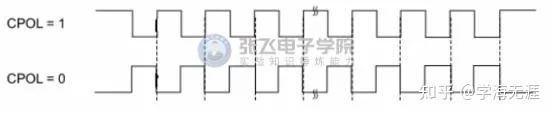

时钟相位（CPHA）：决定数据采集位置（数据输出位置与之相反）是在时钟的第一个跳变沿，还是第二个跳变沿。

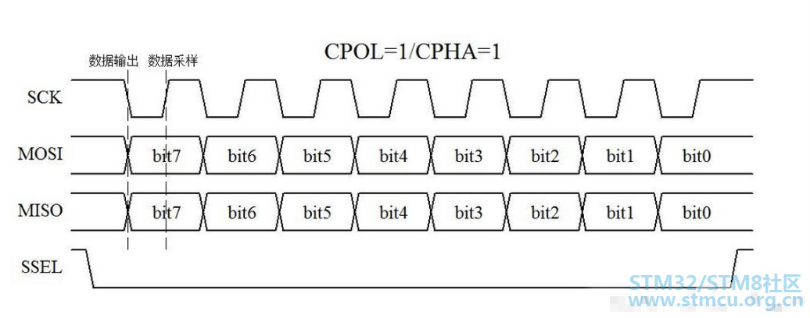

注意：时钟极性和相位主从机必须设置一致（**如果从机是不可编程的，那么要根据从机时序决定**），否则无法进行通信。

有一些芯片以**时钟模式**来定义。

Mode0：CPOL=0，CPHA=0

Mode1：CPOL=0，CPHA=1

Mode2：CPOL=1，CPHA=0

Mode3：CPOL=1，CPHA=1

#### 11.2 应用

举一个读的例子来解释SPI协议在Flash中的应用。

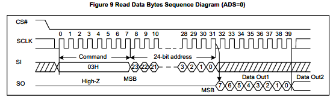

CS# go low, 利用SPI的协议输入8 bit的读command code 03H，再输入想读的地址（门牌号），Flash开始输出内容（房间里面有什么东西）,输出一段时间后，主器件不再需要数据了， CS# go high 退出这个command。


SPI协议可以操作在主器件对**单个**或者**多个**从器件的条件下：

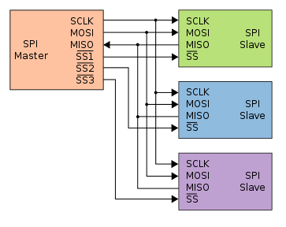

这个时候芯片选择信号有多个，但同一个时间只能有一个SS# （CS#）有效，选中一个从器件，从器件的输出信号MISO（SO）端口都是三态驱动的：

输出高电平 "1";

输出低电平 "0"；

如果SS# (CS# 为high，不选中该从器件 ）则输出高阻态；

被选中的从器件驱动MISO端口输出到主器件的时候，**其它从器件的输出都是高阻态。**

下面是一种CMOS三态驱动门的电路：

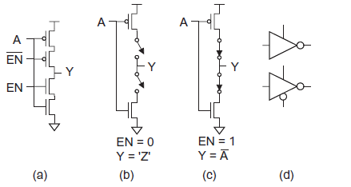

可以看到，EN=0的时候输出没有驱动能力，处于高阻状态。

最后总结一下，SPI协议的优缺点：

**优点**

1. **协议简单利于硬件设计与实现，比如不需要像I2C协议中每个从器件都需要一个地址；只用到4根线，封装也很容易做**
2. **全双工的协议，既能发送数据也能接受数据**
3. **三态输出的驱动能力强，相对I2C的开漏输出，抗干扰能力强，传输稳定；**
4. **相对于I2C协议，时钟速度快，没有最大限制**
5. **输入输出的bit数也没什么限制，不局限于一个byte**

**缺点**

1. **信号线4根，比I2C多，芯片选择线会随着从器件的个数的增加而增加**
2. **传输的过程没有确认信号，撸起柚子加油传，不管从器件收不收到；在SPI Flash中会有read status 这个命令确认从器件的状态，是否处于busy状态**
3. **没有校验机制，I2C也没有，难兄难弟啊**

#### 11.3 SPI读写

PI主机和从机都有一个串行移位寄存器，主机通过向它的SPI串行寄存器写入一个字节来发起一次传输。

- 首先拉低对应SS信号线，表示与该设备进行通信
- 主机通过发送SCLK时钟信号，来告诉从机写数据或者读数据
  这里要注意，SCLK时钟信号可能是低电平有效，也可能是高电平有效，因为SPI有四种模式，这个我们在下面会介绍
- 主机(Master)将要发送的数据写到发送数据缓存区(Menory)，缓存区经过移位寄存器(0~7)，串行移位寄存器通过MOSI信号线将字节一位一位的移出去传送给从机，，同时MISO接口接收到的数据经过移位寄存器一位一位的移到接收缓存区。
- 从机(Slave)也将自己的串行移位寄存器(0~7)中的内容通过MISO信号线返回给主机。同时通过MOSI信号线接收主机发送的数据，这样，两个移位寄存器中的内容就被交换。

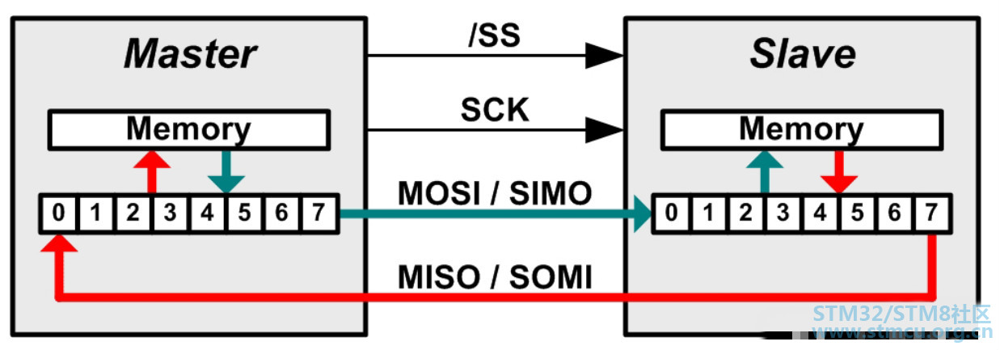

SPI只有主模式和从模式之分，没有读和写的说法，外设的写操作和读操作是同步完成的。如果只进行写操作，主机只需忽略接收到的字节；反之，若主机要读取从机的一个字节，就必须发送一个空字节来引发从机的传输。也就是说，你发一个数据必然会收到一个数据；你要收一个数据必须也要先发一个数据。

#### 11.4 SPI参数配置

```c
typedef struct
{
	uint16_t SPI_Direction; /*!< 传输方向，两向全双工，单向接收等*/
	uint16_t SPI_Mode; /*!< 模式选择，确定主机还是从机 */
	uint16_t SPI_DataSize; /*!< 数据大小，8位还是16位 */
	uint16_t SPI_CPOL; /*!< 时钟极性选择 */
	uint16_t SPI_CPHA; /*!< 时钟相位选择 */
	uint16_t SPI_NSS; /*!< 片选是硬件还是软件*/
	uint16_t SPI_BaudRatePrescaler; /*!< 分频系数,也就是时钟频率 */
	uint16_t SPI_FirstBit; /*!< 指定数据传输是从MSB还是LSB位开始的*/ /*wr_bit_order 1: LSB firs 0: MSB first*/
	uint16_t SPI_CRCPolynomial; /*!< CRC校验 ，设置 CRC 校验多项式，提高通信可靠性，大于 1 即可*/
}SPI_InitTypeDef;

```


#### 参考链接

https://zhuanlan.zhihu.com/p/33356830

https://zhuanlan.zhihu.com/p/366374519

https://zhuanlan.zhihu.com/p/150121520

https://www.analog.com/cn/analog-dialogue/articles/introduction-to-spi-interface.html

https://shequ.stmicroelectronics.cn/forum.php?mod=viewthread&tid=627137

### 12 IIC

1. 通讯正常

# 3 Interesting Issue

## 3.1 芯片复位

复位后，芯片内部会发送什么？会掉电吗？寄存器的值会清0吗？

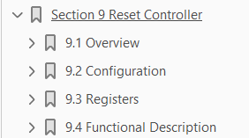

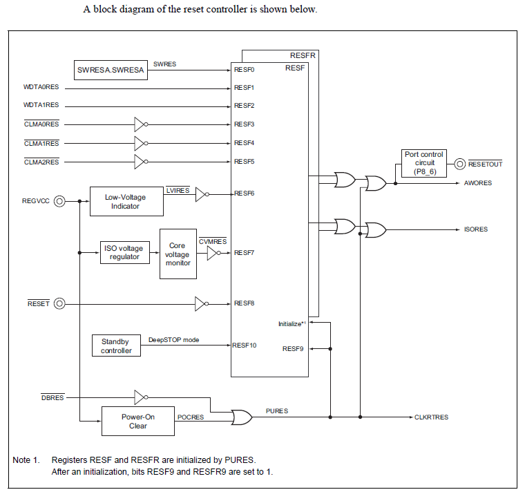

许多IC都包含上电复位（POR）电路，其作用是保证在施加电源后，模拟和数字模块初始化至已知状态。

上电复位（POR）电路有时会集成一个掉电检测器（BOD），用于防止电路在电压非常短暂地意外降低时发生复位，从而避免故障。

### 3.1.1 单调性电源？


## 3.2 SBC(System Basis Chip)

「系統基礎晶片」是一種包含電源、通訊、診斷、安全監控等特性以及通用型輸入輸出(GPIO)的獨立晶片。

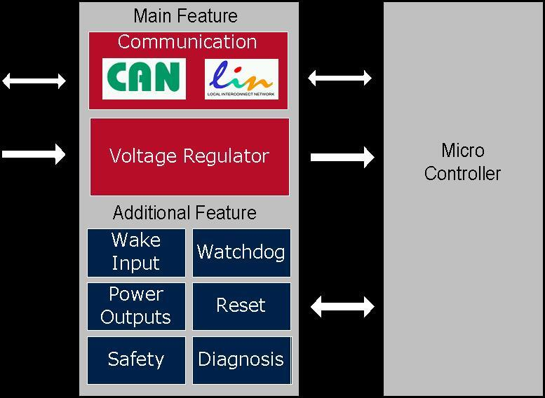

为什么不直接将这些功能集成在微控制器？

电源、通讯和监控（看门狗、计时器）等，都是由多个电路来实现的。基于这些功能的电路设计难度，所以不利于在可靠性、系统成本、电路板空间及电路功耗等方面做出最佳优化。使用SBC，高度整合了这部分功能，使得外部电路大幅简化。

### 3.2.1 主要芯片型号

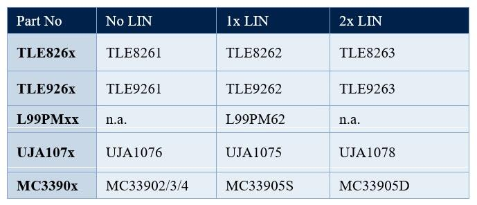

### 3.2.2 SBC的主要特性

一般來說，SBC通常都具備以下一些通用特性：

- 5V/3.3V的電源
- 至少一路CAN (CAN FD)
- 至少一路LIN
- 外部喚醒輸入
- 看門狗功能
- 重設功能
- 通訊介面
- 至少一路或多路GPIO埠，以實現故障輸出/喚醒/高側開關/低側開關
- 帶有喚醒功能的低功耗模式

### 3.2.3 参考链接

https://www.edntaiwan.com/20200107ta31-understanding-Engineer-design-system-basis-chip/                                                                   *電子技術設計雜誌2020年1月號*

## 3.3 CAN COM模块

AUTOSAR COM是AUTOSAR通讯的重要组成部分，它是从OSEK COM标准的基础上发展而来的。它提出了一个不同速率的总线网络之间进行数据交换的方法，为汽车控制单元应用软件提供了统一的通信环境，为内部和外部通信定义了公共的软件通信接口和行为，增强了应用软件模块的可移植性。

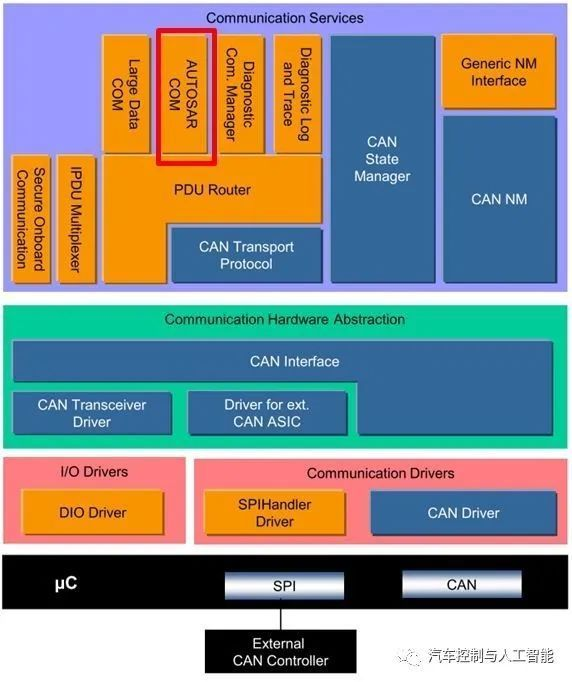


### 参考链接

https://zhuanlan.zhihu.com/p/109104894

## 3.4 程序编写规范

### 3.4.1 函数注释

1.输入参数

2.输出参数

3.返回值

3.函数描述

```c
/**
* \description
*  xxxxxxxxxxxxxx
* \param[in]    WDG_Buf
* \param[in]    index
* \param[out]   Maximum execution time shall be below TODO ms.
* \return     length of Parameter filled
**/
```

## 3.5 高阻态

阻值趋向于无穷大，等效于断路状态。

# Language

## 1 words

token 令牌，标记

volatile /US [ˈvɑlət(ə)l] UK [ˈvɒlətaɪl]/ 异变的，不稳定的

dedicated adj.专注的，专用的

universal 普遍的，通用的，同义词general

Asynchronous 异步，简写aync

synchronous 同步，简写sync

parity 奇偶校验

comprise v.包括，由、、、组成

module 模块

modolu 模数

divisor 除数，约束，除子

reside 驻留，居住

simultaneous 同时发生的，同步的

locality 局部性

Miscellaneous 混杂的，各种各样的

vary 不同，改变

terminated 中止

adjacent	相邻的

occurs v. 发生，出现

introduce v.介绍，引入，实施，推行

bypass v.绕过，避开

perform v.执行

corresponds 相当于、对应

corresponding adj.相应的

trigger v.触发

arbitration n.仲裁

speculative adj.推测的，推断的

sequential v.按次序的、顺序的

eliminate v.消除，淘汰

Privileged adj.享有特权的

resume 个人简历、恢复、重新开始

field	n.字段，领域 

Abstraction 抽象

applicable adj.适用的，可应用的

scope n.作用域，适用范围

denote v.指示

laser n.激光

verify v.验证，核实

prescaler 预分频器

optimize  v.优化

propagation v.传播

usage n.用法

Supervision 监督

respective adj.分别的，各自的

fixed 固定的，不变的

mask	面具，掩码

maskable	可屏蔽中断；屏蔽操作的；中断为可遮罩式

erasure	n.擦除，消灭

deactivated n.停用，未激活

retention n.保持；保留；维持

Exception 例外，异常

expect		v.期望

Encryption	 n.加密

cryptographic	加密的

assessment 	n.评估，评定

evaluate	v. 评估，估计

Cyclic adj.循环的

inverse n.v.adj. 反面的，反面，使反面

Approve	v.批准，赞成

halted adj.n. 停止，中断

console n.控制台，主控台

deinit 去初始化，卸载驱动

declared  声明

appropriate adj.适当的；合适的；适合的

duplication n.复制品，副本

regulator n.稳压器

buck 降压

## 2 combo

is likely to	可能，很有可能

 consists of	由。。。组成

result in	导致

self-managing 自我管理

business group 企业集团 

specific features 具体功能

serving the watchdog 喂狗

Counts down 倒计时

declared implicitly 隐式声明（调用了未声明的函数）

Charge pump 电荷泵

Buck converter n.降压转换器

​	A buck converter (step-down converter) is a DC-to-DC power converter which steps down voltage from its input (supply) to its output (load).

## 3 concept

ab	鸽子

str   键盘

action	绳子

cor / cp 

## 4 abbreviation

Acronyms and abbreviations 缩写

AMBA (Advanced Microcontroller Bus Architecture) 	高级微处理器总线架构

AHB (Advanced High-performance Bus) 	高级高性能总线

cache memory 高速缓冲存储器

Cache tag arrays 缓存标记阵列

Cache data arrays 缓存数据阵列

crossbar switch 交换开关

MPU (Micro processor Unit) 	微处理器

MPU (Memory Protection Unit)	内存管理单元

Error Correcting Code (ECC)	错误校正码

HSI 软硬件接口  hardware software interface

SW 软件

HW 硬件

UPA 测量前后的超声波雷达 Ultrasonic Park Assistant

APA 测量侧方的超声波雷达 


Diagnostic Trouble Code 故障码(DTC)

Floating-point operation coprocessor 浮点运算协处理器(FPU)

ECC 纠错码(error correcting code)

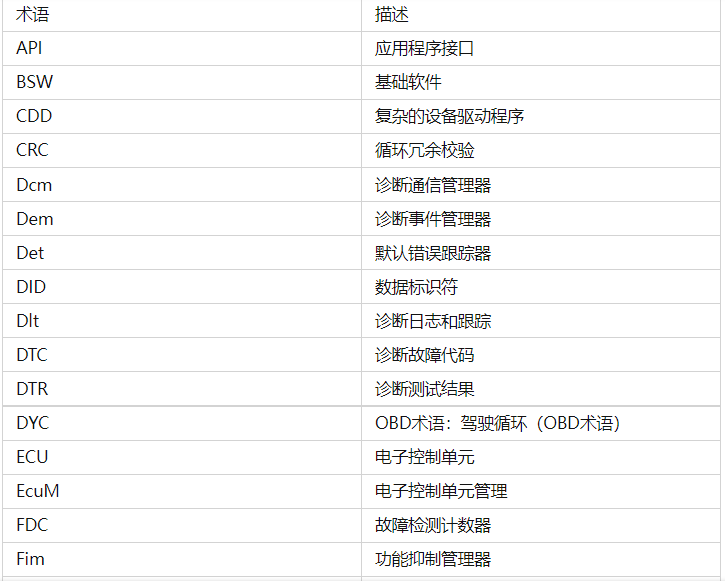

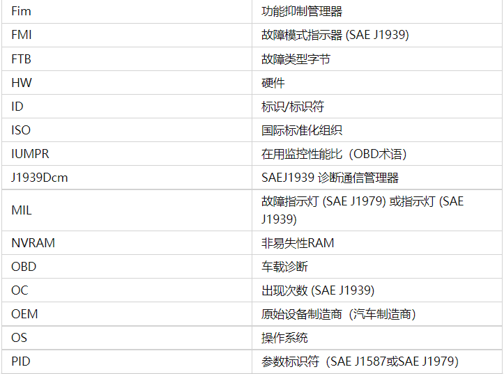


上电复位（POR）

## 5 sentencese

1.60 in hexadecimal corresponds to 96 in decimal

