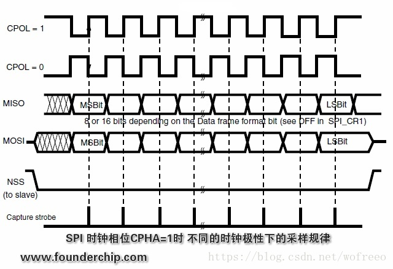

# 一个可以实时显示天气的显示器

## 1 开发流程

1.TFT屏幕

2.SPI接口

3.rots编程

4.图像界面编程库

5.如何获取天气数据

RTWeather-X计划：

**1.建立项目仓库 OK**

**2.使用TFT屏幕 ing**

[code]

**2.1 SPI初始化（配置）**

选择SPI：SPI/HSPI

SPI用于从片外Flash读取CPU程序代码，HSPI用于用户的SPI设备操作

设置SPI模式：主还是从-->主

设置SPI的时钟：需要确定屏幕的时钟

疑问：使用多少频率的时钟，以什么因素作为考虑，从机？

暂时使用8MHZ，感觉够用了

设置片选接口：

设置中断：也就是说接收到数据后做什么操作

设置数据传输格式

数据传输

**ESP8266--SPI模块学习**

与普通 SPI 模块不不同的是，ESP8266 SPI 模块对 SPI 接⼝口的 FLASH 存储器器做了了特殊的⽀支持。因此 ESP8266 SPI 模块的主机与从机模式都有着相应的固定硬件控制协议，与之通信的 SPI 设备需要做对应的匹配处理。

**2.2 初始化TFT屏幕**

参考文档

**2.3 向屏幕发生命令或者数据**

3.使用LVGL在TFT屏幕上显示

=========================================================================

**参考链接：**

https://blog.csdn.net/dpjcn1990/article/details/92829821

[单片机菜鸟哥]

**1 74HC245**

是一种兼容TTL器件引脚的高速CMOS总线收发器（bus transceiver），典型的CMOS型三态缓冲门电路，八路信号收发器。由于单片机或CPU的数据/地址/控制总线端口都有一定的负载能力，如果负载超过其负载能力，一般应加驱动器。主要应用于大屏显示,以及其它的消费类电子产品中增加驱动。

参考链接:http://m.elecfans.com/article/719392.html

**2 基于ST7735S的TFT屏幕**

## 2 **ESP8266 SDK**

RTOS SDK 基于 FreeRTOS，在 Github 上开源。

• RTOS 版本 SDK 使⽤用 FreeRTOS 系统，引⼊入 OS 多任务处理的机制，用户可以使用FreeRTOS 的标准接口实现资源管理理、循环操作、任务内延时、任务间信息传递和同步等⾯面向任务流程的设计方式。具体接口使用方法参考 FreeRTOS 官⽅网站的使用说明或者 USING THE FreeRTOS REAL TIME KERNEL—A Practical Guide 介绍。

• RTOS 版本 SDK 的网络操作接口是标准 lwIP API，同时提供了了 BSD Socket API 接口的封装实现，用户可以直接按照 Socket API 的使用方式来开发软件应用，也可以直接编译运行其他平台的标准 Socket 应用，有效降低平台切换的学习成本。

• RTOS 版本 SDK 引⼊入了了 cJSON 库，使用该库函数可以更加方便的实现对 JSON 数据包的解析。

• RTOS 版本兼容 non-OS SDK 中的 Wi-Fi 接口、SmartConfig 接口、Sniffer 相关接口、系统接口、定时器器接口、FOTA 接口和外围驱动接口，不支持 AT 实现。

### **2.1 To Do**

1.FreeRTOS 标准接口，可参考官方网站文档

2.参考examples里的列子进行二次开发

## 3 ESP8266 SPI

SPI_CPOL：SPI时钟空闲时处于高电平还是低电平

SPI_CPHA：时钟的相位（CPHA）用来决定何时进行信号采样。

当时钟相位为0时（CPHA=0），在SCK信号线的第一个跳变沿进行采样；

当时钟相位为1时（CPHA=1），在SCK信号线的第二个跳变沿进行采样；

这里的跳变沿究竟是上升沿还是下降沿？取决于时钟的极性。

当时钟极性为0时，取下降沿；当时钟极性为1时，取上升沿；

## **4 图形界面-LVGL** 

Every **MCU** which is capable of driving a display via parallel port, SPI, RGB interface or anything else and fulfills the Requirements is supported by LVGL.

**3.1 显示器支持**

LVGL needs just one simple driver function to copy an array of pixels into a given area of the display. If you can do thiswith your **display** then you can use it with LVGL.

列如：

**3.2 如何搭配自己的屏幕**

如上图所示，回调函数.flush_cb就是我们要适配的显示器驱动函数，将buffer里的内容复制到显示器的相关位置里。

my_flush_cb()和put_px()这个两个函数就是我们用于适配的。

put_px()就是将数据写到屏幕的RAM里面去，将图像显示出来。

注意最后必须调用lv_disp_flush_ready()。

**3.3 图像旋转**

Peference Manual 4.2.4 Rotation	

=======================================================================

2021-1-16 

RST引脚：液晶显示器复位引脚 GPIO4--D2 低电平使能

RS 引脚：0：命令  1：数据 GPIO0 --D3 

CS 引脚：0 有效 GPIO15--D8

MOSI--GPIO13--D7

**示波器时基**

​	在[示波器](https://baike.baidu.com/item/示波器)中，若时基是400ns，则每一个横格表示一个时基，即400ns的时间[跨度](https://baike.baidu.com/item/跨度/2197653)。

时基变小，可以使[波形](https://baike.baidu.com/item/波形/742851)放大，当然，也可通过缩放功能实现放大波形，以便观察细微处。

**示波器带宽**

​	
